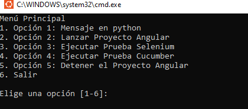
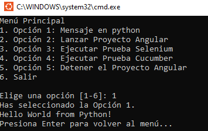
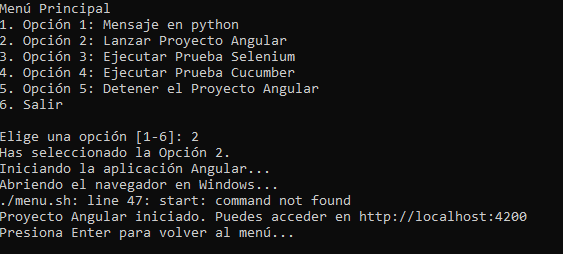
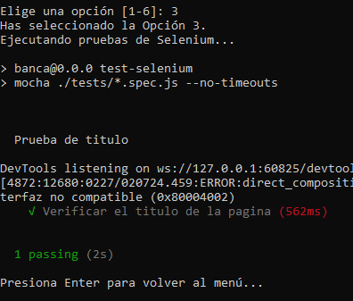
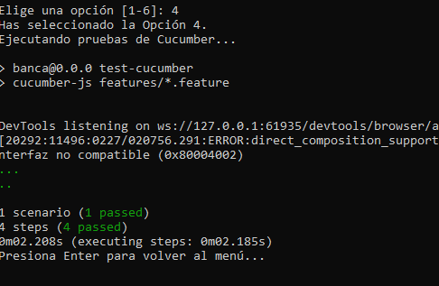
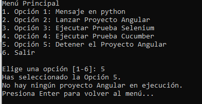
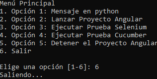

**Tutorial de implementación de WSL en Angular, automatizando procesos y pruebas. 💻🖥**

1. **Instalar WSL: Se abre la terminal y se ejecuta el siguiente comando**: Se instalo una versión de WSL con ubuntu para Windows 10.

```shell notranslate position-relative overflow-auto
 wsl --install
```

2. **Se abre la terminal de WSL: Se abre la terminal de WSL**: En este caso me dirigi a la direccion de mi proyecto de Angular.

```shell notranslate position-relative overflow-auto
 cd /mnt/c/Users/VOSTRO\ DESKTOP/Academia\Frontend/Angular/banca-en-linea
```

3. **Se crea la carpeta 'scripts' y dentro de crea el archivo 'menu.sh'**: se ejecutan los comandos.

```shell notranslate position-relative overflow-auto
 mkdir scripts
 touch menu.sh
 nano menu.sh
```

4. **Se coloca el contenido del archivo.**

```shell notranslate position-relative overflow-auto
#!/bin/bash
# --------------------------------------------------
# Script: menu.sh
# Descripción: Un ejemplo de menú interactivo en Bash.
# Uso: ./menu.sh
# --------------------------------------------------

ANGULAR_PID=""

while true; do
    clear
    echo "Menú Principal"
    echo "1. Opción 1: Mensaje en python"
    echo "2. Opción 2: Lanzar Proyecto Angular"
    echo "3. Opción 3: Ejecutar Prueba Selenium"
    echo "4. Opción 4: Ejecutar Prueba Cucumber"
    echo "5. Opción 5: Detener el Proyecto Angular"
    echo "6. Salir"
    echo
    read -p "Elige una opción [1-6]: " opcion

    case $opcion in
        1)
            echo "Has seleccionado la Opción 1."
            python3 hello.py
            read -p "Presiona Enter para volver al menú..."
            ;;

        2)
            echo "Has seleccionado la Opción 2."

            # Verificar si el proyecto Angular ya está en ejecución
            if [ -n "$ANGULAR_PID" ] && ps -p $ANGULAR_PID > /dev/null; then
                echo "El proyecto Angular ya está en ejecución."
            else
                # Iniciar la aplicación Angular en segundo plano
                echo "Iniciando la aplicación Angular..."
                nohup npm run start > app.log 2>&1 &
                # Guardar el PID del proceso de Angular
                ANGULAR_PID=$!

                # Esperar un momento para que Angular se inicie
                sleep 10

                # Abrir el navegador en Windows
                echo "Abriendo el navegador en Windows..."
                start http://localhost:4200

                echo "Proyecto Angular iniciado. Puedes acceder en http://localhost:4200"
            fi

            read -p "Presiona Enter para volver al menú..."
            ;;

        3)
            echo "Has seleccionado la Opción 3."

            echo "Ejecutando pruebas de Selenium..."
            npm run test-selenium

            read -p "Presiona Enter para volver al menú..."
            ;;

        4)
            echo "Has seleccionado la Opción 4."

            echo "Ejecutando pruebas de Cucumber..."
            npm run test-cucumber

            read -p "Presiona Enter para volver al menú..."
            ;;

        5)
            echo "Has seleccionado la Opción 5."

            if [ -n "$ANGULAR_PID" ] && ps -p $ANGULAR_PID > /dev/null; then
                echo "Deteniendo la aplicación Angular..."
                pkill -P $ANGULAR_PID
                kill $ANGULAR_PID
                ANGULAR_PID=""
                echo "Proceso de Angular detenido."
            else
                echo "No hay ningún proyecto Angular en ejecución."
            fi

            read -p "Presiona Enter para volver al menú..."
            ;;

        6)
            echo "Saliendo..."
            exit 0
            ;;

        *)
            echo "Opción inválida, intenta de nuevo."
            read -p "Presiona Enter para continuar..."
            ;;
    esac
done
```

**Descripción:** Se creo un menú interactivo en la terminal de WSL para ejecutar comandos de Angular y Python.

5. **Se da permisos al archivo de ejecución.**

```shell notranslate position-relative overflow-auto
 chmod +x menu.sh
```

6. **Ejecutamos el script.**: También se pueda dar clic en el archivo y ejecutarlo.

```shell notranslate position-relative overflow-auto
./menu.sh
```

7.**Interfaz del menú en ejecución:**



8.**Casos en ejecución:**













9.**Tambien se creo un script para crear un contenedor de Docker para ejecutar la app de Angular y el menu.**

```shell notranslate position-relative overflow-auto
#!/bin/bash
# --------------------------------------------------
# Script: menu-docker.sh
# Descripción: Crea y ejecuta un contenedor con la aplicación Angular.
# Uso: ./menu-docker.sh
# --------------------------------------------------

# Paso 1: Construir la imagen de Docker sin usar la caché
docker build --no-cache -t test-angular .

# Paso 2: Ejecutar el contenedor en segundo plano
docker run -d -p 4200:4200 --name test-angular test-angular

# Paso 3: Ejecutar el script 'menu.sh' dentro del contenedor
docker exec -it test-angular bash -c "
  # Asegurarse de que el script 'menu.sh' tiene permisos de ejecución
  chmod +x /app/scripts/menu.sh

  # Ejecutar el script 'menu.sh'
  echo 'Abriendo el script de menu...'
  bash /app/scripts/menu.sh
"
```

**Descripción:**
Se crea la imagen de Docker 'test-angular' sin usar la caché, se ejecuta el contenedor en segundo plano en el puerto 4200 y se ejecuta el script 'menu.sh' dentro del contenedor.
